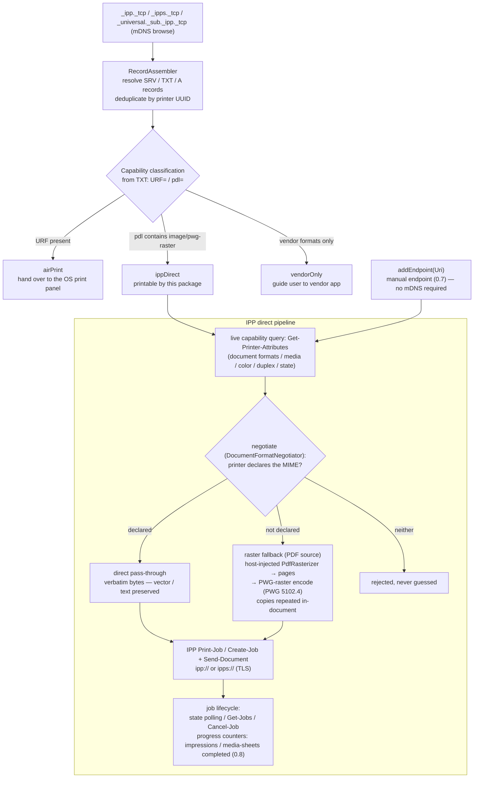

# ipp_print

English | [简体中文](README.zh-CN.md)


-green)


Headless IPP direct-printing kernel for Dart/Flutter: **printer discovery + deterministic capability classification + IPP Print-Job transport** with PWG-raster encoding. No UI by design — presentation and interaction are left to the host app.

## Why this package exists

A large class of inkjet printers (e.g. Epson's L-series tank printers) advertise IPP with `image/pwg-raster` support but **lack Apple's URF raster format**. On iOS, the system print panel (and therefore `printing`-style plugins) will never list such printers — users see an empty, unrecoverable printer list. This package fills that gap: the host app performs mDNS discovery, classifies each printer's capabilities from deterministic Bonjour TXT fields, and speaks IPP itself. **End-to-end paper output has been verified on real hardware (EPSON L3250, a pwg-raster-only tank printer).**

## Discovery: one protocol, two transports

The core protocol is **mDNS/DNS-SD ([RFC 6762](https://www.rfc-editor.org/rfc/rfc6762) / [RFC 6763](https://www.rfc-editor.org/rfc/rfc6763))** on every platform; only the transport to it differs:

- **iOS / macOS — native system Bonjour.** Since iOS 14, raw-socket multicast is silently filtered unless the app holds the `com.apple.developer.networking.multicast` entitlement, which Apple grants only by special request ([Apple TN3179](https://developer.apple.com/documentation/technotes/tn3179-understanding-local-network-privacy)). Naive mDNS implementations therefore discover nothing on iOS — with no error. This package routes browsing through the system Bonjour framework ([`NSNetServiceBrowser`](https://developer.apple.com/documentation/foundation/nsnetservicebrowser)): the `mDNSResponder` daemon does the multicasting, so only the standard Local Network permission prompt is required — no special entitlement. (Detail: `NSNetServiceBrowser` does not support the `_universal._sub._ipp._tcp` subtype; the `_ipp`/`_ipps` pair covers the same instances, deduplicated by UUID.)

> **Deprecation status** (verified against the iOS 26.2 SDK header, `Availability.h` semantics): `NSNetServiceBrowser` is *soft*-deprecated — `API_TO_BE_DEPRECATED`, i.e. slated for formal deprecation in an upcoming release with no version assigned and no compiler warnings today. The recommended successor `nw_browser_t` requires iOS 13 / macOS 10.15, while this package's minimums are iOS 12 / macOS 10.14. Migration is tracked in [TODO.md](TODO.md).
- **Android / Linux / Windows — `multicast_dns`** (raw UDP 5353). On Android the Wi-Fi stack filters multicast packets by default; the host app must acquire a `WifiManager.MulticastLock` (see the [official Android docs](https://developer.android.com/reference/android/net/wifi/WifiManager.MulticastLock)) or discovery will receive nothing.

Routing is automatic (`defaultPlatformDiscovery()`); inject a custom `PrinterDiscovery` to override it.

| Platform | Discovery transport | Requires from the host |
|---|---|---|
| iOS | Native Bonjour (`NSNetServiceBrowser`) | Local Network permission + `NSBonjourServices` in `Info.plist` |
| macOS | Native Bonjour (`NSNetServiceBrowser`) | — |
| Android | `multicast_dns` (UDP 5353) | `WifiManager.MulticastLock` |
| Linux / Windows | `multicast_dns` (UDP 5353) | Firewall must allow UDP 5353 |

Printing itself (IPP over HTTP/TLS) is pure Dart and identical on every platform.

## Features

- **mDNS/DNS-SD discovery** — browses `_ipp._tcp`, `_ipps._tcp` and `_universal._sub._ipp._tcp`, resolves SRV/TXT/A records in parallel, deduplicates by printer UUID (RFC 6763 / PWG 5101.2). Platform-routed: native system Bonjour on iOS/macOS (see below), `multicast_dns` elsewhere.
- **Deterministic capability classification** — from TXT records (`URF=` / `pdl=`), never guessed:
  - `airPrint` — has URF; hand over to the OS print panel.
  - `ippDirect` — no URF but `pdl` contains `image/pwg-raster`; printable via this package.
  - `vendorOnly` — vendor-private formats only; guide the user to a vendor app.
- **IPP 1.1 client** (RFC 8010 / RFC 8011): `Print-Job`, `Create-Job` + `Send-Document` (multi-document), `Get-Printer-Attributes`, `Get-Job-Attributes`, `Get-Jobs`, `Cancel-Job`; job-state polling with transient-fault tolerance.
- **Capability engine** — `inspect()` requests 26 standard attributes (identity, state + reasons, accepting-jobs, document formats, media, color, duplex, resolutions, copies range, finishings, print quality, IPP versions, operations, URI security) and parses them into 27 capability fields, **leniently from deterministic printer self-report** (RFC 8011 §6.2) — a missing attribute means unsupported, never inferred. New syntax decoders: resolution (§5.1.16), rangeOfInteger (§5.1.14), boolean (§5.1.12).
- **Validate-Job preflight** — `validateJob()` asks the printer "can you print this job?" (operation 0x0004, no document data) and returns a structured `PrintValidationResult` including the Unsupported Attributes group (tag 0x05), so multi-megabyte documents are only submitted after an explicit go-ahead.
- **Job Engine** — split `submit()` / `monitor()` / `getJob()` / `cancel()` responsibilities (0.6): submitting returns an immutable `PrintJob` snapshot (job-state seven values + job-level `job-state-reasons`), `monitor()` polls as a state stream until a terminal state with bounded transient-fault absorption; `print()` progress streams stay fully backward compatible, both sharing one gate→negotiate→encode source.
- **Job progress counters** (0.8) — `PrintJob` / `IppJobSummary` carry `impressionsCompleted` (RFC 8011 §5.3.18.2) and `mediaSheetsCompleted` (§5.3.18.3), requested by default in job queries and passed through unchanged. Raw counters only — **never converted into "pages"**: an impression is one side of a media sheet (§2.3.4), so copies/duplex/N-up make it diverge from the host's page count; deriving "page X of Y" is host-side (Y must come from the host's own page count, printers generally do not report `job-impressions`). Missing or out-of-band values (`no-value`, RFC 8010 §3.5.2) surface as `null`; PWG 5100.14 v1.1 Table 11 lists `job-impressions-completed` (with `job-impressions`) as IPP Everywhere Required, so certified driverless printers always report it (`job-media-sheets-completed` is only RECOMMENDED per RFC 8011 §5.3.18.3).
- **Manual endpoint** — `addEndpoint(Uri)` (0.7): undiscovered ≠ unprintable. For networks where mDNS is blocked, cross-subnet, or known-address scenarios; the URI itself is the user's assertion that an IPP endpoint exists, while capability is still decided by live queries + the negotiator (probe-driven). Honest parsing: scheme whitelist, standard default ports, ambiguous URIs rejected.
- **TLS transport** — printers advertising only `_ipps._tcp` are directly printable (`https://` endpoint, self-signed certificates accepted by default).
- **PWG-raster encoder** (PWG 5102.4): 1796-octet `cups_page_header2_t` page header, file-level `RaS2` sync word (once per document), row groups (1-octet row repeat count, 1–256 rows) with pixel-granularity PackBits-like run-length encoding (sRGB-8, bpp=3) — validated byte-for-byte against the spec's §4.4.2 sample bitmap and CUPS `raster-stream.c`. Real-printer verified (EPSON L3250, end-to-end paper output).
- **Flutter-free protocol core** — the IPP codec, domain models, format negotiator and PWG-raster encoder are pure Dart and unit-testable offline (no `dart:ui`). The package itself *is* a Flutter plugin: discovery talks to the platform Bonjour channel (`MethodChannel`, hence `package:flutter/services.dart`) and the debug logger reads `kDebugMode`. So facade-level tests need `flutter test`; plain `dart test` loads only the protocol-core subset (the facade/discovery test files cannot resolve the Flutter SDK). PDF rasterization is injected through the `PdfRasterizer` port (e.g. backed by `printing`'s `rasterPdf`).

### How this compares with `printing`

| | OS print panel (via `printing`) | ipp_print |
|---|---|---|
| AirPrint (URF) printers | ✅ listed | classified `airPrint` → handed to the panel |
| pwg-raster-only printers (no URF) | ❌ never listed | ✅ direct IPP printing |
| UI | system print panel | none — headless API, host owns the UX |

## How it works



## Install

```yaml
dependencies:
  ipp_print:
    path: packages/ipp_print
```

> Not published to pub.dev yet; use a path or git dependency for now.

## Usage

Minimal end-to-end flow (see [`example/main.dart`](example/main.dart) for an offline API sample — it injects a fake discovery and a fake rasterizer, and is compiled as part of this package's analysis unit):

```dart
final ipp = IppPrint();

// 1. Discover every broadcasting printer on the LAN.
final printers = await ipp.discover(timeout: const Duration(seconds: 5));
for (final p in printers) {
  final capability = CapabilityClassifier.classify(p.txt);
  // airPrint     -> hand over to the system print panel
  // ippDirect    -> printable via this package
  // vendorOnly   -> guide user to vendor app / PDF export
  print('${p.name}: $capability (${p.ippUriString})');
}

// 2. Probe the chosen printer for negotiated capabilities.
final status = await ipp.probe(printer);

// 2b. Or inspect it in depth: what exactly can this machine do?
final caps = await ipp.inspect(printer);
print(caps.makeModel);          // "EPSON L3250 Series"
print(caps.documentFormats);    // from document-format-supported
print(caps.colorModesSupported); // host UI options — never guessed
print('${caps.copiesMin}-${caps.copiesMax} copies');

// 2c. Preflight a job ticket before submitting megabytes of data.
final validation = await ipp.validateJob(
  printer,
  documentFormat: 'image/pwg-raster',
  options: const PrintOptions(duplex: 'two-sided-long-edge'),
);
if (!validation.valid) { /* surface validation.statusCode to the host */ }

// 3. Print via IPP direct connection.
if (status == PrinterProbeStatus.ready) {
  // 3a. General entry (0.4 Document Pipeline): the kernel queries the
  // printer's document-format-supported live and routes — declared MIME
  // → passthrough (verbatim bytes, vector/text preserved); else
  // image/pwg-raster → raster fallback (PDF source + PdfRasterizer);
  // else throws. PDF direct-print works opportunistically on printers
  // that declare application/pdf (SHOULD per IPP Everywhere §6).
  // 0.5: the TXT gate only rejects `unknown` (no IPP evidence) — printers
  // declaring IPP+PDF are no longer rejected wholesale.
  await for (final progress in ipp.print(
    document: PrintDocument(bytes: pdfBytes, mimeType: 'application/pdf'),
    printer: printer,
    rasterizer: myPdfRasterizer, // required for the raster fallback
    ticket: const PrintTicket(copies: 2), // 0.5 semantic job model
  )) {
    print('${progress.stage}${progress.page != null ? ' p${progress.page}' : ''}');
  }

  // 3b. Convenience wrapper: same as 3a with mimeType application/pdf.
  await for (final progress in ipp.printPdf(
    pdfBytes: pdfBytes,
    printer: printer,
    rasterizer: myPdfRasterizer, // implements PdfRasterizer
  )) {
    print('${progress.stage}${progress.page != null ? ' p${progress.page}' : ''}');
  }
}

// 0.5: local ticket pre-check (no network) — pair with Validate-Job
// (device-level) for two-layer validation.
final check = ipp.validateTicket(
  ticket: const PrintTicket(media: 'iso_a4_210x297mm', copies: 2),
  capabilities: caps,
);
if (!check.valid) {
  print(check.unsupportedAttributes); // e.g. ['media']
}
```

### Job options

`print()` takes a `PrintTicket` (0.5 semantic model); `printPdf` accepts the
transport-level `PrintOptions` (bridged via `PrintTicket.fromOptions`):

**Unified semantics: `null` = attribute omitted**, so the printer applies its
own `*-default` (RFC 8011 §5.2 job-template default semantics). Pass `null`
whenever the printer's declared capabilities do not determine a value — never
guess one.

| Field | Default | IPP job attribute | Notes |
|---|---|---|---|
| `copies` | `1` | `copies` | integer (always sent; there is no "printer default" for copies). On the **raster fallback** path the copies are realised **in the document** — the whole page sequence is repeated `copies` times, collated — and the attribute is pinned to `1`; on the **direct-send** path the value is passed through unchanged. See Limitation 8. |
| `media` | `null` | `media` | PWG name; should come from the printer's `media-supported` (`null` = omitted → `media-default`) |
| `sides` (ticket) / `duplex` (options) | `null` | `sides` | `one-sided` / `two-sided-long-edge` / `two-sided-short-edge`; should be a member of `sides-supported` (`null` = omitted → `sides-default`) |
| `colorMode` | `null` | `print-color-mode` | `null` = attribute omitted → the printer applies its own `print-color-mode-default` per RFC 8011 (typically `auto`). Explicit values (`color` / `monochrome`, …) are sent as-is and should be a member of the printer's `print-color-mode-supported` (full value set: PWG 5107.3 §6.2.27). |
| `resolution` | `null` | `printer-resolution` | 0.5: PWG keyword form (`360x360dpi`); should come from `printer-resolution-supported` |
| `fidelity` | `null` | `ipp-attribute-fidelity` | 0.5: `exact` sends `true` (printer MUST reject unsupported values); `null`/`bestEffort` = omitted → best-effort per RFC 8011 default |

### Capability negotiation (host UI data source)

Beyond media and formats, `probe()`'s `PrinterInfo` also exposes color and
duplex capability declarations so host UIs can **offer only values the printer
declares support for**:

| Field | IPP printer attribute |
|---|---|
| `colorModesSupported` / `colorModeDefault` | `print-color-mode-supported` / `-default` |
| `sidesSupported` / `sidesDefault` | `sides-supported` / `-default` |
| `resolutionsSupported` / `resolutionDefault` | `printer-resolution-supported` / `-default` (0.3.1) |

Engineering rule: capabilities come from deterministic IPP fields only —
**never inferred from the printer model**.

Raster dpi should be negotiated from `resolutionsSupported`: the historical
hard-coded 300 dpi is **not** in every printer's declared set (real-device
finding on the EPSON L3250: only `360x360dpi` / `1440x720dpi` are declared).
`printPdf(dpi: …)` overrides the PWG page-header resolution per call.

### iOS host requirements

Discovery triggers the local-network privacy prompt. Declare in `Info.plist`:

```xml
<key>NSLocalNetworkUsageDescription</key>
<string>This app searches your local network for printers.</string>
<key>NSBonjourServices</key>
<array>
  <string>_ipp._tcp</string>
  <string>_ipps._tcp</string>
  <string>_universal._sub._ipp._tcp</string>
</array>
```

(See [Apple TN3179](https://developer.apple.com/documentation/technotes/tn3179-understanding-local-network-privacy), *Understanding local network privacy*.)

### Debug logging

The kernel narrates everything it does on one channel, every line prefixed
`[ipp_print]`. It is Dart `print` output on standard output, which `flutter run`
and `flutter logs` display — that is also how you read it from a device, since
those commands attach to the running app.

**There is no runtime switch, and that is deliberate.** The gate is a compile-time
`assert`, so a release build emits nothing at all — debug-only by design
(`TODO.md`: *DEBUG logs are for developers; `DiagnosticReport` is for the
product*). Print from a debug build when you need to see what happened.

What you get, in the order a print job produces it:

- **transport** — one line per request and one per response: the operation name
  (read from the wire, so it is the operation actually sent), the endpoint, request
  and response byte counts, **both** the HTTP status and the IPP status (named, not
  numeric), and the round-trip time. A response line is written even when the HTTP
  status is an error, so "a request with no response" in the log really does mean
  the request never came back;
- **ignored attributes** — whenever a response carries an Unsupported Attributes
  group, its attribute names are listed, and the line says so when the status sits
  in the success range and nothing else will report it. Conversely, if the status
  is one for which RFC 8011 §4.1.7 *requires* that group and the printer sent
  none, that is reported too. This is the line that turns "the printer quietly
  did something else" into a one-line diagnosis;
- **pipeline** — the negotiation outcome (direct pass-through vs raster fallback,
  and the format chosen), the produced document (page count, bytes, copy
  semantics), the `job-id`, and the terminal state with `job-state-reasons`;
- **discovery** — one line per accepted printer and one per skipped instance,
  naming the reason (no SRV record, or no usable `rp`).

`Get-Job-Attributes` polls are logged every iteration, so waiting on a job is
verbose on purpose — a job that never reaches a terminal state is exactly when
you want the trail. See *Limitations* for what this channel does **not** cover.

## Implementation decisions ← standards mapping

Every protocol behavior traces back to an authoritative source; community implementations are used for cross-checking only, never as a basis:

| Decision | Standard | Clause |
|---|---|---|
| Encoding order tag → name-len → name → value-len → value | RFC 8010 (IPP/1.1 Encoding & Transport; obsoletes RFC 2910) | §3.1.4 |
| Multi-valued attribute = tag + zero-length name | RFC 8010 | §3.1.5 |
| Requests must include attributes-charset / attributes-natural-language / printer-uri | RFC 8011 (IPP/1.1 Model) | §4.1.4, Appendix A |
| Operation codes (Print-Job 0x0002, Validate-Job 0x0004, Create-Job 0x0005, Send-Document 0x0006, Cancel-Job 0x0008, Get-Job-Attributes 0x0009, Get-Jobs 0x000A, Get-Printer-Attributes 0x000B) | RFC 8011 + IANA IPP Registrations | §5.4.15 |
| Job Template attributes live in request Group 2; `ipp-attribute-fidelity` is a Group 1 operation attribute | RFC 8011 | §4.2.1.1 |
| `print-quality` job template (type2 enum: 3=draft / 4=normal / 5=high); conflicting with `printer-resolution`, printer SHOULD prefer `print-quality` | RFC 8011 | §5.2.13, Table 12 |
| `Create-Job` (no document data, no document-format) + `Send-Document` (last-document is a Client MUST) | RFC 8011 | §4.2.4, §4.3.1 |
| Print-Job response REQUIRED: job-id / job-state / job-state-reasons | RFC 8011 | §4.2.1.2 |
| Boolean values are always 1 byte (0x00/0x01) | RFC 8011 | §5.1.12 |
| job-state values 3–9 | RFC 8011 / IPP Guide | §5.3.7 |
| printer-state values 3–5 | RFC 8011 | §5.4.11 |
| `Cancel-Job` (job-id required) | RFC 8011 / IPP Guide | §4.3.3, Appendix A |
| `Get-Jobs` (which-jobs / my-jobs / requested-attributes) | RFC 8011 / IPP Guide | §4.2.6, Appendix A |
| `ipps://` transport (IPP over HTTPS + ipps URI scheme) | RFC 7472 | §3–4 |
| `Validate-Job` preflight (op 0x0004, no document data; Unsupported Attributes returned in group 2) | RFC 8011 | §4.2.3 |
| Capability query set (`xxx-supported` / `xxx-default`; printer not answering = unsupported) | RFC 8011 | §6.2 |
| PWG-raster page header (1796-octet `cups_page_header2_t`, file-level `RaS2` sync word, sRGB-8 = 19) | PWG 5102.4 | §4 |
| Self-describing media names `iso_a4_210x297mm` | PWG 5101.1 (Media Names) | — |
| Browsing `_ipp._tcp` / `_ipps._tcp` / `_universal._sub._ipp._tcp` | RFC 6763 (DNS-SD) + Apple AirPrint spec | — |
| TXT keys `rp` / `pdl` / `UUID` / `ty` | PWG 5101.2 (Bonjour Printing Spec) | — |
| `ipp://` logical URI for printer-uri, HTTP `POST application/ipp` | IPP Guide (istopwg) | Ch. 1 |
| Querying `media-supported` / `document-format-supported` | IPP Guide | Ch. 2 |

References: RFC 8010 / RFC 8011 / RFC 6762 (mDNS) / RFC 6763 (DNS-SD) /
RFC 7472 (IETF), PWG 5101.1 / 5101.2 / 5102.4 (PWG),
[IPP Guide](https://istopwg.github.io/ipp/ippguide.html),
[IANA IPP Registrations](https://www.iana.org/assignments/ipp-registrations/),
[Apple TN3179](https://developer.apple.com/documentation/technotes/tn3179-understanding-local-network-privacy)
and the [`NSNetServiceBrowser` API reference](https://developer.apple.com/documentation/foundation/nsnetservicebrowser).
HP's [jipp](https://github.com/HPInc/jipp) and the istopwg guide
serve as capability checklists.

## Limitations

1. **mDNS-broadcasting devices only** — USB-connected, offline, or non-broadcasting printers are invisible (same as the OS print panel).
2. **Self-signed TLS accepted by default** — printer certificates are self-signed as a rule; the `ipps://` channel validates encryption but not identity (strict mode via `IppClient(acceptSelfSignedTls: false)`).
3. **PDF direct-send is opportunistic, not guaranteed** — a document is submitted verbatim only when the printer **declares** that MIME in `document-format-supported` (queried live, never from a cached probe). Otherwise the kernel falls back to `image/pwg-raster`, which requires an injected `PdfRasterizer` and a PDF source; a printer declaring neither is rejected rather than guessed (IPP Everywhere makes PDF only a SHOULD).
4. **Resolution / color mode / print quality are sent only when you ask for them** — `null` means the attribute is omitted and the printer applies its own `*-default` (RFC 8011 §5.2). Raster dpi defaults to 300, which is **not** in every printer's `printer-resolution-supported` (real device: the EPSON L3250 declares only `360x360dpi` / `1440x720dpi`), so negotiate it from `PrinterInfo.resolutionsSupported` or override per call with `printPdf(dpi: …)`. The PWG page header is always sRGB-8.
5. **AirPrint-class printers are not intercepted** — devices classified as `airPrint` are handed to the OS print panel.
6. **A resource path is never invented** — a service that broadcasts IPP without a usable `rp` TXT value (absent or empty) is skipped on **both** transports; add such a printer explicitly with `addEndpoint`. This replaced a divergence: the native Bonjour path used to fall back to `/ipp/print` while the `multicast_dns` path dropped the instance, so the same printer could appear on iOS/macOS and be missing on Android/Linux/Windows. `rp` is optional in Bonjour printing but mandatory for IPP Everywhere (PWG 5100.14), so the affected devices are non-conforming and their real path is unknowable to us — a guess would surface a printer that then fails at print time. TXT keys are matched case-insensitively (RFC 6763 §6.2).
7. **Discovery timeout semantics differ between transports** — the native browser is bounded by one hard deadline, while `MDnsPrinterDiscovery` resolves instances serially, so its worst case is roughly `10 s × number of instances` rather than the requested timeout.

8. **Copies are produced by the client on the raster path, and left to the printer on the direct-send path** — a streaming raster document (`image/pwg-raster`) cannot rely on the printer to duplicate it: CUPS itself forces `copies = 1` for `image/*` and `application/vnd.cups-raster` and lets the upstream filter pre-produce the copies (`cups/ppd-cache.c` `_cupsConvertOptions`), and some printers advertise `copies-supported` yet answer `successful-ok-ignored-or-substituted-attributes` (`0x0001`) and print a single copy — a status this package treats as success, so the shortfall would otherwise be silent. The raster path therefore repeats the **whole page sequence** `copies` times (collated, per RFC 8011 §5.2.5 / §2.3.10 Set semantics) and sends `copies=1`. On the direct-send path (e.g. `application/pdf`) the client cannot pre-produce copies inside the payload, so `copies` is passed through and the outcome depends on the printer's RIP. Note that `copies` is a **REQUIRED** Job Template attribute in IPP Everywhere (PWG 5100.14 Table 8, §9.3) for jpeg/pdf-capable printers, so a printer that accepts the value and silently ignores it is non-conforming.

9. **The debug log has no runtime switch and no levels** — it is gated by a compile-time `assert`, so a release build emits nothing, which puts field diagnosis on a user's device out of its scope (that is `DiagnosticReport`, planned for 0.8.x). Messages are also built eagerly at the call site, and string construction in a release build is **not guaranteed** to be eliminated (interpolation may call `toString`); the magnitude has not been benchmarked, so "zero cost" is not claimed. The channel is raw `print`, not `debugPrint`: Flutter throttles `debugPrint` because platforms rate-limit their logging — the implementation comment reads *"This avoids dropping messages on platforms that rate-limit their logging (for example, Android)"* (`foundation/print.dart`) — so raw `print` can in principle be dropped there. The volume is two lines per operation, far below that ceiling, but the boundary is real. The transport layer logs both directions for every operation, so a job polled every 2 s is verbose by design.

## FAQ

**Why doesn't iOS list my network printer (e.g. an Epson tank printer)?**
Most likely the printer lacks Apple's URF raster format, and the iOS print panel only lists AirPrint printers. AirPrint requires `URF=` in the printer's Bonjour TXT record (or `image/urf` in `pdl=`); many tank models advertise only `image/pwg-raster`. This package was built exactly for that class of printers.

**Why can't the Flutter `printing` plugin find this printer?**
Because `printing` hands printing over to the OS print panel — and the panel never lists non-AirPrint printers. This is a platform limitation, not a plugin bug. A common combination: `printing.rasterPdf` for rasterization plus this package for discovery and IPP transport.

**Will my printer work with this package? How can I check?**
It qualifies if the printer advertises IPP with `image/pwg-raster` but no URF. From macOS: `dns-sd -B _ipp._tcp` lists instances, `dns-sd -L <instance> _ipp._tcp` reads the TXT record — no `URF=` and `pdl=` containing `image/pwg-raster` means direct printing works. The package's capability classifier performs exactly this check at runtime.

**How does this package relate to `printing`?**
They are complementary. `printing` renders PDFs and drives the system print panel; this package adds discovery and IPP transport for printers that panel cannot see. Inject a `PdfRasterizer` backed by `printing`'s `rasterPdf` to build the full pipeline.

## Roadmap

**CORE FREEZE since 0.7.0** — the kernel contract (Contract v2) is frozen;
0.7.x accepts only bug fixes, protocol correctness, compatibility, performance,
tests, and platform adaptations. Future enhancements (streaming discovery,
diagnostics) are additive-only candidates tracked in [TODO.md](TODO.md);
released changes are recorded in [CHANGELOG.md](CHANGELOG.md).

## License

[MIT](LICENSE)
