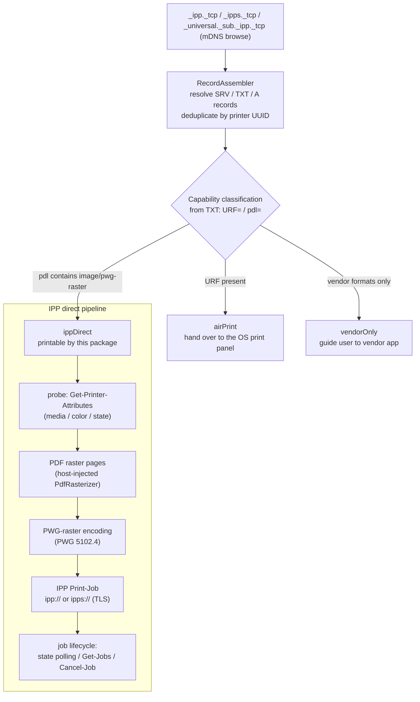

# ipp_print

English | [简体中文](README.zh-CN.md)


-green)


Headless IPP direct-printing kernel for Dart/Flutter: **printer discovery + deterministic capability classification + IPP Print-Job transport** with PWG-raster encoding. No UI by design — presentation and interaction are left to the host app.

## Why this package exists

A large class of inkjet printers (e.g. Epson's L-series tank printers) advertise IPP with `image/pwg-raster` support but **lack Apple's URF raster format**. On iOS, the system print panel (and therefore `printing`-style plugins) will never list such printers — users see an empty, unrecoverable printer list. This package fills that gap: the host app performs mDNS discovery, classifies each printer's capabilities from deterministic Bonjour TXT fields, and speaks IPP itself.

## Features

- **mDNS/DNS-SD discovery** — browses `_ipp._tcp`, `_ipps._tcp` and `_universal._sub._ipp._tcp`, resolves SRV/TXT/A records in parallel, deduplicates by printer UUID (RFC 6763 / PWG 5101.2).
- **Deterministic capability classification** — from TXT records (`URF=` / `pdl=`), never guessed:
  - `airPrint` — has URF; hand over to the OS print panel.
  - `ippDirect` — no URF but `pdl` contains `image/pwg-raster`; printable via this package.
  - `vendorOnly` — vendor-private formats only; guide the user to a vendor app.
- **IPP 1.1 client** (RFC 8010 / RFC 8011): `Print-Job`, `Get-Printer-Attributes`, `Get-Job-Attributes`, `Get-Jobs`, `Cancel-Job`; job-state polling with transient-fault tolerance.
- **TLS transport** — printers advertising only `_ipps._tcp` are directly printable (`https://` endpoint, self-signed certificates accepted by default).
- **PWG-raster encoder** (PWG 5102.4): 36-byte RaS2 header, run-length rows, sRGB-8 — validated by golden-byte tests.
- **Pure Dart, zero Flutter dependencies** — the protocol core is unit-testable offline; PDF rasterization is injected through the `PdfRasterizer` port (e.g. backed by `printing`'s `rasterPdf`).

## How it works



## Install

```yaml
dependencies:
  ipp_print: ^0.1.0
```

> While in development, use a path or git dependency instead.

## Usage

Minimal end-to-end flow (see [`example/main.dart`](example/main.dart) for a runnable offline version):

```dart
final ipp = IppPrint();

// 1. Discover every broadcasting printer on the LAN.
final printers = await ipp.discover(timeout: const Duration(seconds: 5));
for (final p in printers) {
  final capability = CapabilityClassifier.classify(p.txt);
  // airPrint     -> hand over to the system print panel
  // ippDirect    -> printable via this package
  // vendorOnly   -> guide user to vendor app / PDF export
  print('${p.name}: $capability (${p.ippUriString})');
}

// 2. Probe the chosen printer for negotiated capabilities.
final status = await ipp.probe(printer);

// 3. Print a PDF via IPP direct connection (ippDirect only).
if (status == PrinterProbeStatus.ready) {
  await for (final progress in ipp.printPdf(
    pdfBytes: pdfBytes,
    printer: printer,
    rasterizer: myPdfRasterizer, // implements PdfRasterizer
  )) {
    print('${progress.stage}${progress.page != null ? ' p${progress.page}' : ''}');
  }
}
```

### iOS host requirements

Discovery triggers the local-network privacy prompt. Declare in `Info.plist`:

```xml
<key>NSLocalNetworkUsageDescription</key>
<string>This app searches your local network for printers.</string>
<key>NSBonjourServices</key>
<array>
  <string>_ipp._tcp</string>
  <string>_ipps._tcp</string>
  <string>_universal._sub._ipp._tcp</string>
</array>
```

(See Apple TN3179, *Understanding local network privacy*.)

## Implementation decisions ← standards mapping

Every protocol behavior traces back to an authoritative source; community implementations are used for cross-checking only, never as a basis:

| Decision | Standard | Clause |
|---|---|---|
| Encoding order tag → name-len → name → value-len → value | RFC 8010 (IPP/1.1 Encoding & Transport; obsoletes RFC 2910) | §3.1.4 |
| Multi-valued attribute = tag + zero-length name | RFC 8010 | §3.1.5 |
| Requests must include attributes-charset / attributes-natural-language / printer-uri | RFC 8011 (IPP/1.1 Model) | §4.1.4, Appendix A |
| Operation codes (Print-Job 0x0002, Cancel-Job 0x0008, Get-Job-Attributes 0x0009, Get-Jobs 0x000A, Get-Printer-Attributes 0x000B) | RFC 8011 + IANA IPP Registrations | §5.4.15 |
| Boolean values are always 1 byte (0x00/0x01) | RFC 8011 | §5.1.12 |
| job-state values 3–9 | RFC 8011 / IPP Guide | §5.3.7 |
| printer-state values 3–5 | RFC 8011 | §5.4.11 |
| `Cancel-Job` (job-id required) | RFC 8011 / IPP Guide | §4.3.3, Appendix A |
| `Get-Jobs` (which-jobs / my-jobs / requested-attributes) | RFC 8011 / IPP Guide | §4.2.6, Appendix A |
| `ipps://` transport (IPP over HTTPS + ipps URI scheme) | RFC 7472 | §3–4 |
| PWG-raster page header (RaS2, 36 B, sRGB-8 = 19) | PWG 5102.4 | — |
| Self-describing media names `iso_a4_210x297mm` | PWG 5101.1 (Media Names) | — |
| Browsing `_ipp._tcp` / `_ipps._tcp` / `_universal._sub._ipp._tcp` | RFC 6763 (DNS-SD) + Apple AirPrint spec | — |
| TXT keys `rp` / `pdl` / `UUID` / `ty` | PWG 5101.2 (Bonjour Printing Spec) | — |
| `ipp://` logical URI for printer-uri, HTTP `POST application/ipp` | IPP Guide (istopwg) | Ch. 1 |
| Querying `media-supported` / `document-format-supported` | IPP Guide | Ch. 2 |

References: RFC 8010 / RFC 8011 / RFC 7472 (IETF), PWG 5101.1 / 5101.2 / 5102.4 (PWG),
[IPP Guide](https://istopwg.github.io/ipp/ippguide.html),
[IANA IPP Registrations](https://www.iana.org/assignments/ipp-registrations/),
Apple TN3179. HP's [jipp](https://github.com/HPInc/jipp) and the istopwg guide
serve as capability checklists.

## Limitations

1. **mDNS-broadcasting devices only** — USB-connected, offline, or non-broadcasting printers are invisible (same as the OS print panel).
2. **Self-signed TLS accepted by default** — printer certificates are self-signed as a rule; the `ipps://` channel validates encryption but not identity (strict mode via `IppClient(acceptSelfSignedTls: false)`).
3. **No PDF direct-send** — direct printing requires the printer to declare `image/pwg-raster` in `pdl` (the classifier guarantees no misdirected jobs).
4. **Fixed 300 dpi / sRGB-8** — resolution/color negotiation is not implemented yet (`printer-resolution` is not sent).
5. **AirPrint-class printers are not intercepted** — devices classified as `airPrint` are handed to the OS print panel.

## FAQ

**Why doesn't iOS list my network printer (e.g. an Epson tank printer)?**
Most likely the printer lacks Apple's URF raster format, and the iOS print panel only lists AirPrint printers. AirPrint requires `URF=` in the printer's Bonjour TXT record (or `image/urf` in `pdl=`); many tank models advertise only `image/pwg-raster`. This package was built exactly for that class of printers.

**Why can't the Flutter `printing` plugin find this printer?**
Because `printing` hands printing over to the OS print panel — and the panel never lists non-AirPrint printers. This is a platform limitation, not a plugin bug. A common combination: `printing.rasterPdf` for rasterization plus this package for discovery and IPP transport.

**Will my printer work with this package? How can I check?**
It qualifies if the printer advertises IPP with `image/pwg-raster` but no URF. From macOS: `dns-sd -B _ipp._tcp` lists instances, `dns-sd -L <instance> _ipp._tcp` reads the TXT record — no `URF=` and `pdl=` containing `image/pwg-raster` means direct printing works. The package's capability classifier performs exactly this check at runtime.

**How does this package relate to `printing`?**
They are complementary. `printing` renders PDFs and drives the system print panel; this package adds discovery and IPP transport for printers that panel cannot see. Inject a `PdfRasterizer` backed by `printing`'s `rasterPdf` to build the full pipeline.

## Roadmap

Planned work (TLS transport, job management, capability negotiation, …) is
tracked in [TODO.md](TODO.md); released changes are recorded in
[CHANGELOG.md](CHANGELOG.md).

## License

[MIT](LICENSE)
