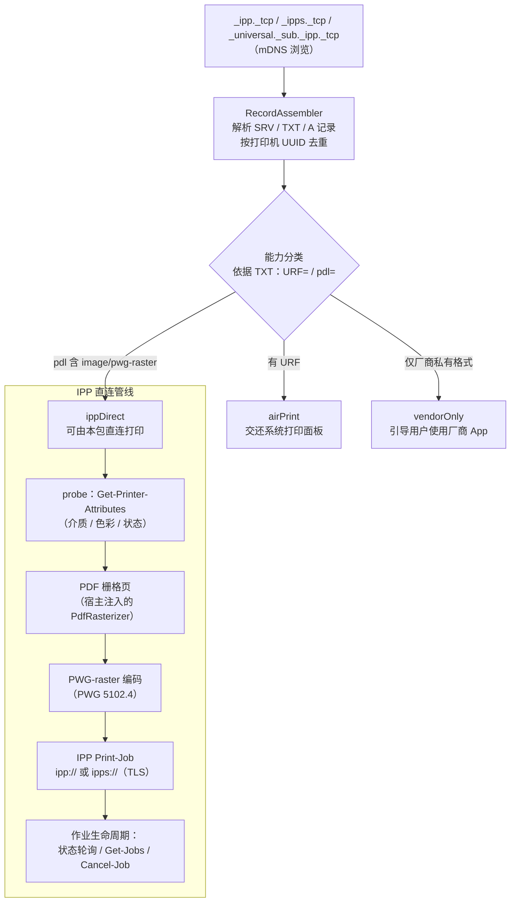

# ipp_print

[English](README.md) | 简体中文


-green)


面向 Dart/Flutter 的无界面 IPP 直连打印内核：**打印机发现 + 确定性能力分类 + IPP Print-Job 传输**，含 PWG-raster 编码。刻意不含 UI——展示与交互全部留给宿主 App。

## 这个包为什么存在

一大类喷墨打印机（如爱普生 L 系列墨仓机）在广播中声明支持 `image/pwg-raster`，但**缺少 Apple 的 URF 光栅格式**。在 iOS 上，系统打印面板（以及 `printing` 这类依赖系统面板的插件）永远不会列出这类打印机——用户面对的是无法恢复的空白列表。本包填补该空洞：由宿主 App 自行完成 mDNS 发现、基于确定性 Bonjour TXT 字段的能力分类，以及 IPP 传输。**真机端到端出纸已验证通过（EPSON L3250，仅广播 pwg-raster 的墨仓机）。**

## 发现：一个协议，两条传输路径

核心协议在任何平台都是 **mDNS/DNS-SD（[RFC 6762](https://www.rfc-editor.org/rfc/rfc6762) / [RFC 6763](https://www.rfc-editor.org/rfc/rfc6763)）**，不同的只是抵达组播层的通道：

- **iOS / macOS —— 原生系统 Bonjour。** 自 iOS 14 起，裸 socket 组播流量会被系统**静默过滤**，除非 App 持有 `com.apple.developer.networking.multicast` 特批 entitlement（Apple 仅按申请特批，见 [TN3179](https://developer.apple.com/documentation/technotes/tn3179-understanding-local-network-privacy)）。朴素的 mDNS 实现在 iOS 上因此 0 发现——且无任何报错。本包改走系统 Bonjour 框架（[`NSNetServiceBrowser`](https://developer.apple.com/documentation/foundation/nsnetservicebrowser)）：组播由 `mDNSResponder` 守护进程代收，豁免该权限，只需标准的「本地网络」授权弹窗——无需任何特殊 entitlement。（细节：`NSNetServiceBrowser` 不支持 `_universal._sub._ipp._tcp` 子类型；`_ipp`/`_ipps` 双广播已覆盖相同实例，按 UUID 去重。）

> **弃用状态**（已对照 iOS 26.2 SDK 头文件与 `Availability.h` 官方语义核实）：`NSNetServiceBrowser` 处于**软弃用**——`API_TO_BE_DEPRECATED`，即将在后续版本正式弃用、未分配版本号、当前无编译器警告。官方建议的继任者 `nw_browser_t` 要求 iOS 13 / macOS 10.15，而本包最低部署目标为 iOS 12 / macOS 10.14。迁移事项见 [TODO.md](TODO.md)。
- **Android / Linux / Windows —— `multicast_dns`**（裸 UDP 5353）。Android 的 Wi-Fi 栈默认过滤组播包，宿主 App 必须持有 `WifiManager.MulticastLock`（见 [Android 官方文档](https://developer.android.com/reference/android/net/wifi/WifiManager.MulticastLock)），否则发现层收不到任何响应。

平台路由自动完成（`defaultPlatformDiscovery()`）；注入自定义 `PrinterDiscovery` 即可覆盖。

| 平台 | 发现通道 | 宿主需提供 |
|---|---|---|
| iOS | 原生 Bonjour（`NSNetServiceBrowser`） | 本地网络授权 + `Info.plist` 声明 `NSBonjourServices` |
| macOS | 原生 Bonjour（`NSNetServiceBrowser`） | — |
| Android | `multicast_dns`（UDP 5353） | `WifiManager.MulticastLock` |
| Linux / Windows | `multicast_dns`（UDP 5353） | 防火墙放行 UDP 5353 |

打印传输本身（IPP over HTTP/TLS）为纯 Dart，全平台一致。

## 特性

- **mDNS/DNS-SD 发现** —— 浏览 `_ipp._tcp`、`_ipps._tcp` 与 `_universal._sub._ipp._tcp`，SRV/TXT/A 记录并行解析，按打印机 UUID 去重（RFC 6763 / PWG 5101.2）。平台路由：Apple 平台走原生系统 Bonjour（见下节），其余平台走 `multicast_dns`。
- **确定性能力分类** —— 全部来自 TXT 记录（`URF=` / `pdl=`），绝不猜测：
  - `airPrint` —— 有 URF；交还系统打印面板。
  - `ippDirect` —— 无 URF 但 `pdl` 含 `image/pwg-raster`；可由本包直连打印。
  - `vendorOnly` —— 仅厂商私有格式；引导用户使用厂商 App。
- **IPP 1.1 客户端**（RFC 8010 / RFC 8011）：`Print-Job`、`Get-Printer-Attributes`、`Get-Job-Attributes`、`Get-Jobs`、`Cancel-Job`；作业状态轮询带瞬态故障容错。
- **能力引擎** —— `inspect()` 返回 `PrinterCapabilities`：24 项标准属性（身份、状态与原因、是否收作业、文档格式、介质、色彩、双面、分辨率、份数区间、整饰、IPP 版本、操作集、URI 安全），全部**从打印机确定性自报 lenient 解析**（RFC 8011 §6.2）——属性缺失即不支持，绝不推断。新值语法解码：resolution（§5.1.14）、rangeOfInteger（§5.1.15）、boolean（§5.1.12）。
- **Validate-Job 预检** —— `validateJob()` 先问打印机「这个 Job 你能不能处理」（操作码 0x0004，不带文档数据），返回结构化 `PrintValidationResult`（含 Unsupported Attributes 组，组 tag 0x05）——大文档只在明确放行后才提交。
- **TLS 传输** —— 仅广播 `_ipps._tcp` 的机型可直接打印（`https://` 端点，默认接受自签证书）。
- **PWG-raster 编码器**（PWG 5102.4）：1796 字节 `cups_page_header2_t` 页头 + 文件级 `RaS2` 同步字（每文档一次）+ 行组（1 字节行重复计数，1–256 行）+ 像素粒度 PackBits-like 游程编码（sRGB-8，bpp=3）—— 与规范 §4.4.2 样本位图及 CUPS `raster-stream.c` 逐字节比对验证；真机出纸验证通过（EPSON L3250）。
- **纯 Dart，零 Flutter 依赖** —— 协议核心可离线单测；PDF 栅格化通过 `PdfRasterizer` 端口注入（例如由 `printing` 的 `rasterPdf` 实现）。

### 与 `printing` 的对比

| | 系统打印面板（经 `printing`） | ipp_print |
|---|---|---|
| AirPrint（有 URF）机型 | ✅ 可列出 | 分类为 `airPrint` → 交还系统面板 |
| 仅 pwg-raster（无 URF）机型 | ❌ 永远不可见 | ✅ IPP 直连打印 |
| UI | 系统打印面板 | 无——无界面 API，交互由宿主掌控 |

## 工作原理



## 安装

```yaml
dependencies:
  ipp_print:
    path: packages/ipp_print
```

> 尚未发布到 pub.dev，现阶段请使用 path 或 git 依赖。

## 用法

最小端到端流程（可离线运行的版本见 [`example/main.dart`](example/main.dart)）：

```dart
final ipp = IppPrint();

// 1. 发现局域网内所有广播中的打印机。
final printers = await ipp.discover(timeout: const Duration(seconds: 5));
for (final p in printers) {
  final capability = CapabilityClassifier.classify(p.txt);
  // airPrint   -> 交还系统打印面板
  // ippDirect  -> 可由本包直连打印
  // vendorOnly -> 引导用户使用厂商 App / 导出 PDF
  print('${p.name}: $capability (${p.ippUriString})');
}

// 2. 探测所选打印机，协商能力。
final status = await ipp.probe(printer);

// 2b. 或深度检视：这台机器究竟能干什么？
final caps = await ipp.inspect(printer);
print(caps.makeModel);           // "EPSON L3250 Series"
print(caps.documentFormats);     // 来自 document-format-supported
print(caps.colorModesSupported); // 宿主 UI 可选项——绝不猜测
print('${caps.copiesMin}-${caps.copiesMax} 份');

// 2c. 提交大文档前先预检作业票。
final validation = await ipp.validateJob(
  printer,
  documentFormat: 'image/pwg-raster',
  options: const PrintOptions(duplex: 'two-sided-long-edge'),
);
if (!validation.valid) { /* 把 validation.statusCode 呈现给宿主 */ }

// 3. 通过 IPP 直连打印 PDF（仅 ippDirect）。
if (status == PrinterProbeStatus.ready) {
  await for (final progress in ipp.printPdf(
    pdfBytes: pdfBytes,
    printer: printer,
    rasterizer: myPdfRasterizer, // 实现 PdfRasterizer
  )) {
    print('${progress.stage}${progress.page != null ? ' p${progress.page}' : ''}');
  }
}
```

### 作业选项

`printPdf` 可传 `PrintOptions`：

**统一语义：`null` = 不下发该属性**，由打印机应用自身 `*-default`
（RFC 8011 §5.2 job template 默认值语义）。宿主无法从打印机声明能力中
确定取值时应传 `null`，而**不是猜一个值**。

| 字段 | 默认值 | 对应 IPP 作业属性 | 说明 |
|---|---|---|---|
| `copies` | `1` | `copies` | 份数（恒下发；份数无「打印机默认」语义） |
| `media` | `null` | `media` | PWG 介质名；应取自打印机 `media-supported`（`null` = 不下发，用 `media-default`） |
| `duplex` | `null` | `sides` | `one-sided` / `two-sided-long-edge` / `two-sided-short-edge`；取值应为 `sides-supported` 的成员（`null` = 不下发，用 `sides-default`） |
| `colorMode` | `null` | `print-color-mode` | `null` = 不下发 → 打印机用 `print-color-mode-default`（典型为 `auto`）。显式指定（`color` / `monochrome` 等）则原样下发，取值应为打印机 `print-color-mode-supported` 的成员（全集见 PWG 5107.3 §6.2.27）。 |

### 能力协商（宿主 UI 数据源）

`probe()` 的 `PrinterInfo` 除介质/格式外，还透出色彩与双面能力声明，
供宿主 UI **只展示打印机声明支持的取值**：

| 字段 | 对应 IPP 打印机属性 |
|---|---|
| `colorModesSupported` / `colorModeDefault` | `print-color-mode-supported` / `-default` |
| `sidesSupported` / `sidesDefault` | `sides-supported` / `-default` |
| `resolutionsSupported` / `resolutionDefault` | `printer-resolution-supported` / `-default`（0.3.1） |

工程纪律：能力只来自 IPP 确定性字段，**禁止按机型推断**。

栅格化 dpi 应从 `resolutionsSupported` 协商：历史硬编码 300dpi **并非**
所有打印机的声明值（L3250 真机事实：仅声明 `360x360dpi` / `1440x720dpi`）。
`printPdf(dpi: …)` 可按次覆盖 PWG 页头分辨率。

### iOS 宿主配置

发现行为会触发本地网络隐私弹窗，需在 `Info.plist` 声明：

```xml
<key>NSLocalNetworkUsageDescription</key>
<string>此应用需要在本地网络中搜索打印机。</string>
<key>NSBonjourServices</key>
<array>
  <string>_ipp._tcp</string>
  <string>_ipps._tcp</string>
  <string>_universal._sub._ipp._tcp</string>
</array>
```

（参见 [Apple TN3179](https://developer.apple.com/documentation/technotes/tn3179-understanding-local-network-privacy)《理解本地网络隐私》。）

## 实现决策 ← 标准条款对照

每条协议行为都可回溯到权威来源；社区实现仅用于交叉核对，从不作为依据：

| 实现决策 | 标准依据 | 条款 |
|---|---|---|
| 编码序 tag → name-len → name → value-len → value | RFC 8010（IPP/1.1 编码与传输；废止 RFC 2910） | §3.1.4 |
| 同名多值 = tag + 零长度名 | RFC 8010 | §3.1.5 |
| 请求必含 attributes-charset / attributes-natural-language / printer-uri | RFC 8011（IPP/1.1 Model） | §4.1.4、Appendix A |
| 操作码（Print-Job 0x0002、Cancel-Job 0x0008、Get-Job-Attributes 0x0009、Get-Jobs 0x000A、Get-Printer-Attributes 0x000B） | RFC 8011 + IANA IPP 注册表 | §5.4.15 |
| boolean 值恒 1 字节（0x00/0x01） | RFC 8011 | §5.1.12 |
| job-state 值域 3–9 | RFC 8011 / IPP Guide | §5.3.7 |
| printer-state 值域 3–5 | RFC 8011 | §5.4.11 |
| `Cancel-Job`（job-id 必需） | RFC 8011 / IPP Guide | §4.3.3、Appendix A |
| `Get-Jobs`（which-jobs / my-jobs / requested-attributes） | RFC 8011 / IPP Guide | §4.2.6、Appendix A |
| `ipps://` 传输（IPP over HTTPS + ipps URI scheme） | RFC 7472 | §3–4 |
| `Validate-Job` 预检（操作码 0x0004，无文档数据；Unsupported Attributes 在组 2 返回） | RFC 8011 | §4.2.3 |
| 能力查询集（`xxx-supported` / `xxx-default`；打印机未应答该属性 = 不支持） | RFC 8011 | §6.2 |
| PWG-raster 页头（1796 字节 `cups_page_header2_t`，文件级 RaS2 同步字，sRGB-8=19） | PWG 5102.4 | §4 |
| 介质自描述名 `iso_a4_210x297mm` | PWG 5101.1（Media Names） | — |
| 浏览 `_ipp._tcp` / `_ipps._tcp` / `_universal._sub._ipp._tcp` | RFC 6763（DNS-SD）+ Apple AirPrint 规约 | — |
| TXT 键 `rp` / `pdl` / `UUID` / `ty` | PWG 5101.2（Bonjour Printing Spec） | — |
| `printer-uri` 用 `ipp://` 逻辑 URI，HTTP `POST application/ipp` | IPP Guide（istopwg） | Ch. 1 |
| 查询 `media-supported` / `document-format-supported` 能力 | IPP Guide | Ch. 2 |

参考：RFC 8010 / RFC 8011 / RFC 6762（mDNS）/ RFC 6763（DNS-SD）/ RFC 7472（IETF）、
PWG 5101.1 / 5101.2 / 5102.4（PWG）、
[IPP Guide](https://istopwg.github.io/ipp/ippguide.html)、
[IANA IPP Registrations](https://www.iana.org/assignments/ipp-registrations/)、
[Apple TN3179](https://developer.apple.com/documentation/technotes/tn3179-understanding-local-network-privacy)
与 [`NSNetServiceBrowser` API 文档](https://developer.apple.com/documentation/foundation/nsnetservicebrowser)。
HP 官方 [jipp](https://github.com/HPInc/jipp) 与 istopwg 指南
作为能力清单核对基准。

## 边界（诚实清单）

1. **仅限 mDNS 广播设备** —— USB 直连、离线、不发广播的打印机不可见（与系统打印面板同限）。
2. **TLS 默认接受自签证书** —— 打印机证书普遍为自签；`ipps://` 通道校验加密但不校验身份（严格模式可用 `IppClient(acceptSelfSignedTls: false)`）。
3. **不支持 PDF 直投** —— 直连打印要求打印机在 `pdl` 中声明 `image/pwg-raster`（分类器保证不会误投）。
4. **固定 300 dpi / sRGB-8** —— 分辨率/色彩协商尚未实现（不发送 `printer-resolution`）。
5. **不接管 AirPrint 机型** —— 分类为 `airPrint` 的设备交还系统打印面板。

## FAQ

**为什么 iOS 列不出我的网络打印机（比如爱普生墨仓机）？**
最可能的原因是打印机缺少 Apple 的 URF 光栅格式，而 iOS 打印面板只列 AirPrint 打印机。AirPrint 要求打印机的 Bonjour TXT 记录含 `URF=`（或 `pdl=` 含 `image/urf`）；很多墨仓机型只广播 `image/pwg-raster`。本包正是为这一类打印机而建。

**为什么 Flutter 的 `printing` 插件发现不了这台打印机？**
因为 `printing` 把打印交给系统打印面板——而面板永远不会列出非 AirPrint 打印机。这是平台限制，不是插件的 Bug。常见组合：`printing.rasterPdf` 负责栅格化 + 本包负责发现与 IPP 传输。

**我的打印机适用吗？怎么自查？**
判据：打印机广播 IPP 且 `pdl=` 含 `image/pwg-raster`、但没有 `URF=`。macOS 下用 `dns-sd -B _ipp._tcp` 找到实例，再用 `dns-sd -L <实例名> _ipp._tcp` 读 TXT 记录——无 `URF=` 且 `pdl=` 含 `image/pwg-raster` 即可直连打印。本包的能力分类器在运行时做的正是这个判定。

**这个包和 `printing` 是什么关系？**
互补而非竞争。`printing` 负责渲染 PDF 与驱动系统打印面板；本包为面板看不见的打印机补上发现与 IPP 传输。注入一个由 `printing` 的 `rasterPdf` 实现的 `PdfRasterizer` 即可拼出完整管线。

## Roadmap

已规划事项（分辨率/色彩能力协商、介质协商等）见 [TODO.md](TODO.md)；
已发布变更记录于 [CHANGELOG.md](CHANGELOG.md)。

## 许可证

[MIT](LICENSE)
