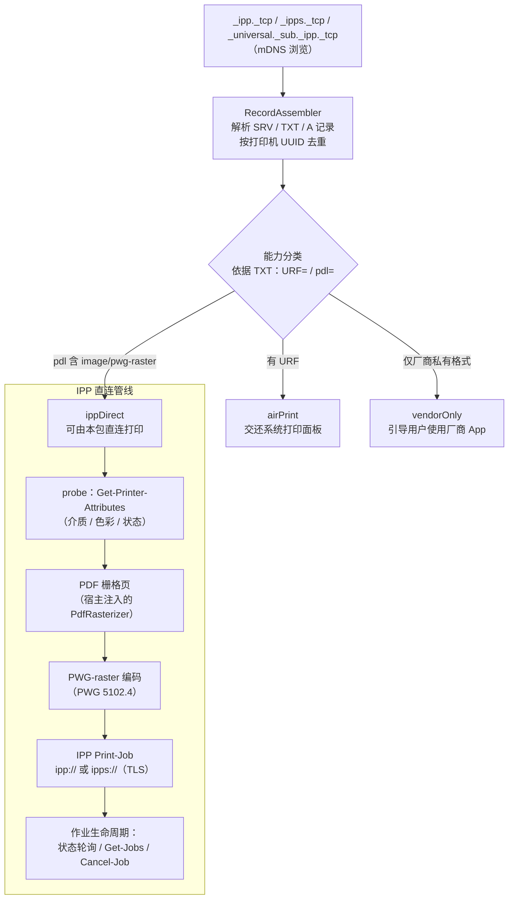

# ipp_print

[English](README.md) | 简体中文


-green)


面向 Dart/Flutter 的无界面 IPP 直连打印内核：**打印机发现 + 确定性能力分类 + IPP Print-Job 传输**，含 PWG-raster 编码。刻意不含 UI——展示与交互全部留给宿主 App。

## 这个包为什么存在

一大类喷墨打印机（如爱普生 L 系列墨仓机）在广播中声明支持 `image/pwg-raster`，但**缺少 Apple 的 URF 光栅格式**。在 iOS 上，系统打印面板（以及 `printing` 这类依赖系统面板的插件）永远不会列出这类打印机——用户面对的是无法恢复的空白列表。本包填补该空洞：由宿主 App 自行完成 mDNS 发现、基于确定性 Bonjour TXT 字段的能力分类，以及 IPP 传输。

## 特性

- **mDNS/DNS-SD 发现** —— 浏览 `_ipp._tcp`、`_ipps._tcp` 与 `_universal._sub._ipp._tcp`，SRV/TXT/A 记录并行解析，按打印机 UUID 去重（RFC 6763 / PWG 5101.2）。
- **确定性能力分类** —— 全部来自 TXT 记录（`URF=` / `pdl=`），绝不猜测：
  - `airPrint` —— 有 URF；交还系统打印面板。
  - `ippDirect` —— 无 URF 但 `pdl` 含 `image/pwg-raster`；可由本包直连打印。
  - `vendorOnly` —— 仅厂商私有格式；引导用户使用厂商 App。
- **IPP 1.1 客户端**（RFC 8010 / RFC 8011）：`Print-Job`、`Get-Printer-Attributes`、`Get-Job-Attributes`、`Get-Jobs`、`Cancel-Job`；作业状态轮询带瞬态故障容错。
- **TLS 传输** —— 仅广播 `_ipps._tcp` 的机型可直接打印（`https://` 端点，默认接受自签证书）。
- **PWG-raster 编码器**（PWG 5102.4）：36 字节 RaS2 页头 + 行程编码行，sRGB-8 —— 由金标字节测试锚定。
- **纯 Dart，零 Flutter 依赖** —— 协议核心可离线单测；PDF 栅格化通过 `PdfRasterizer` 端口注入（例如由 `printing` 的 `rasterPdf` 实现）。

## 工作原理



## 安装

```yaml
dependencies:
  ipp_print: ^0.1.0
```

> 开发阶段请改用 path 或 git 依赖。

## 用法

最小端到端流程（可离线运行的版本见 [`example/main.dart`](example/main.dart)）：

```dart
final ipp = IppPrint();

// 1. 发现局域网内所有广播中的打印机。
final printers = await ipp.discover(timeout: const Duration(seconds: 5));
for (final p in printers) {
  final capability = CapabilityClassifier.classify(p.txt);
  // airPrint   -> 交还系统打印面板
  // ippDirect  -> 可由本包直连打印
  // vendorOnly -> 引导用户使用厂商 App / 导出 PDF
  print('${p.name}: $capability (${p.ippUriString})');
}

// 2. 探测所选打印机，协商能力。
final status = await ipp.probe(printer);

// 3. 通过 IPP 直连打印 PDF（仅 ippDirect）。
if (status == PrinterProbeStatus.ready) {
  await for (final progress in ipp.printPdf(
    pdfBytes: pdfBytes,
    printer: printer,
    rasterizer: myPdfRasterizer, // 实现 PdfRasterizer
  )) {
    print('${progress.stage}${progress.page != null ? ' p${progress.page}' : ''}');
  }
}
```

### iOS 宿主配置

发现行为会触发本地网络隐私弹窗，需在 `Info.plist` 声明：

```xml
<key>NSLocalNetworkUsageDescription</key>
<string>此应用需要在本地网络中搜索打印机。</string>
<key>NSBonjourServices</key>
<array>
  <string>_ipp._tcp</string>
  <string>_ipps._tcp</string>
  <string>_universal._sub._ipp._tcp</string>
</array>
```

（参见 Apple TN3179《理解本地网络隐私》。）

## 实现决策 ← 标准条款对照

每条协议行为都可回溯到权威来源；社区实现仅用于交叉核对，从不作为依据：

| 实现决策 | 标准依据 | 条款 |
|---|---|---|
| 编码序 tag → name-len → name → value-len → value | RFC 8010（IPP/1.1 编码与传输；废止 RFC 2910） | §3.1.4 |
| 同名多值 = tag + 零长度名 | RFC 8010 | §3.1.5 |
| 请求必含 attributes-charset / attributes-natural-language / printer-uri | RFC 8011（IPP/1.1 Model） | §4.1.4、Appendix A |
| 操作码（Print-Job 0x0002、Cancel-Job 0x0008、Get-Job-Attributes 0x0009、Get-Jobs 0x000A、Get-Printer-Attributes 0x000B） | RFC 8011 + IANA IPP 注册表 | §5.4.15 |
| boolean 值恒 1 字节（0x00/0x01） | RFC 8011 | §5.1.12 |
| job-state 值域 3–9 | RFC 8011 / IPP Guide | §5.3.7 |
| printer-state 值域 3–5 | RFC 8011 | §5.4.11 |
| `Cancel-Job`（job-id 必需） | RFC 8011 / IPP Guide | §4.3.3、Appendix A |
| `Get-Jobs`（which-jobs / my-jobs / requested-attributes） | RFC 8011 / IPP Guide | §4.2.6、Appendix A |
| `ipps://` 传输（IPP over HTTPS + ipps URI scheme） | RFC 7472 | §3–4 |
| PWG-raster 页头（RaS2，36 字节，sRGB-8=19） | PWG 5102.4 | — |
| 介质自描述名 `iso_a4_210x297mm` | PWG 5101.1（Media Names） | — |
| 浏览 `_ipp._tcp` / `_ipps._tcp` / `_universal._sub._ipp._tcp` | RFC 6763（DNS-SD）+ Apple AirPrint 规约 | — |
| TXT 键 `rp` / `pdl` / `UUID` / `ty` | PWG 5101.2（Bonjour Printing Spec） | — |
| `printer-uri` 用 `ipp://` 逻辑 URI，HTTP `POST application/ipp` | IPP Guide（istopwg） | Ch. 1 |
| 查询 `media-supported` / `document-format-supported` 能力 | IPP Guide | Ch. 2 |

参考：RFC 8010 / RFC 8011 / RFC 7472（IETF）、PWG 5101.1 / 5101.2 / 5102.4（PWG）、
[IPP Guide](https://istopwg.github.io/ipp/ippguide.html)、
[IANA IPP Registrations](https://www.iana.org/assignments/ipp-registrations/)、
Apple TN3179。HP 官方 [jipp](https://github.com/HPInc/jipp) 与 istopwg 指南
作为能力清单核对基准。

## 边界（诚实清单）

1. **仅限 mDNS 广播设备** —— USB 直连、离线、不发广播的打印机不可见（与系统打印面板同限）。
2. **TLS 默认接受自签证书** —— 打印机证书普遍为自签；`ipps://` 通道校验加密但不校验身份（严格模式可用 `IppClient(acceptSelfSignedTls: false)`）。
3. **不支持 PDF 直投** —— 直连打印要求打印机在 `pdl` 中声明 `image/pwg-raster`（分类器保证不会误投）。
4. **固定 300 dpi / sRGB-8** —— 分辨率/色彩协商尚未实现（不发送 `printer-resolution`）。
5. **不接管 AirPrint 机型** —— 分类为 `airPrint` 的设备交还系统打印面板。

## FAQ

**为什么 iOS 列不出我的网络打印机（比如爱普生墨仓机）？**
最可能的原因是打印机缺少 Apple 的 URF 光栅格式，而 iOS 打印面板只列 AirPrint 打印机。AirPrint 要求打印机的 Bonjour TXT 记录含 `URF=`（或 `pdl=` 含 `image/urf`）；很多墨仓机型只广播 `image/pwg-raster`。本包正是为这一类打印机而建。

**为什么 Flutter 的 `printing` 插件发现不了这台打印机？**
因为 `printing` 把打印交给系统打印面板——而面板永远不会列出非 AirPrint 打印机。这是平台限制，不是插件的 Bug。常见组合：`printing.rasterPdf` 负责栅格化 + 本包负责发现与 IPP 传输。

**我的打印机适用吗？怎么自查？**
判据：打印机广播 IPP 且 `pdl=` 含 `image/pwg-raster`、但没有 `URF=`。macOS 下用 `dns-sd -B _ipp._tcp` 找到实例，再用 `dns-sd -L <实例名> _ipp._tcp` 读 TXT 记录——无 `URF=` 且 `pdl=` 含 `image/pwg-raster` 即可直连打印。本包的能力分类器在运行时做的正是这个判定。

**这个包和 `printing` 是什么关系？**
互补而非竞争。`printing` 负责渲染 PDF 与驱动系统打印面板；本包为面板看不见的打印机补上发现与 IPP 传输。注入一个由 `printing` 的 `rasterPdf` 实现的 `PdfRasterizer` 即可拼出完整管线。

## Roadmap

已规划事项（TLS 传输、作业管理、能力协商等）见 [TODO.md](TODO.md)；
已发布变更记录于 [CHANGELOG.md](CHANGELOG.md)。

## 许可证

[MIT](LICENSE)
